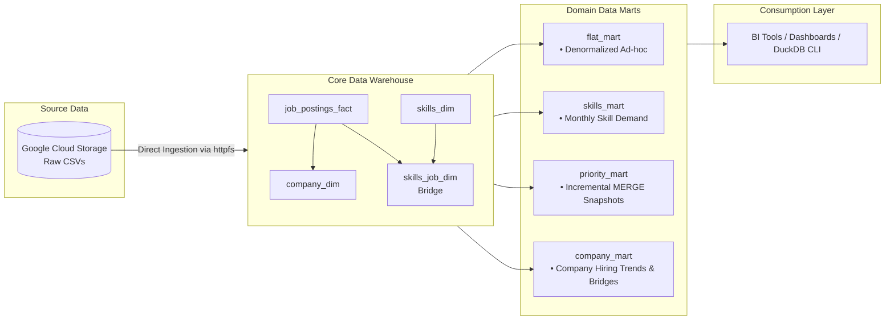
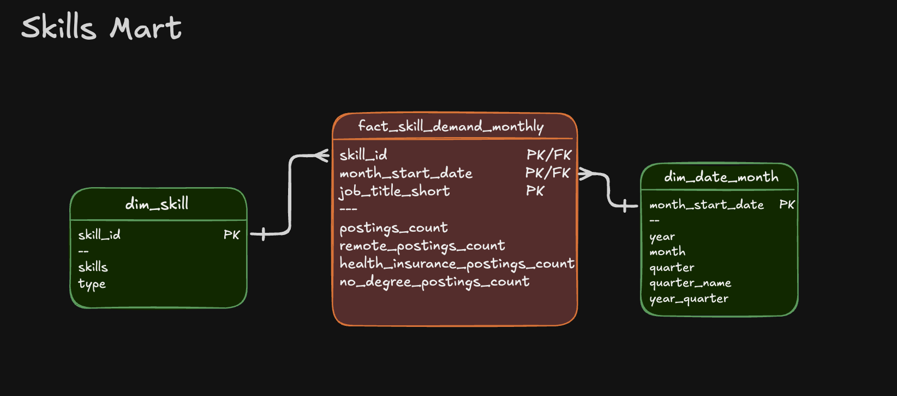
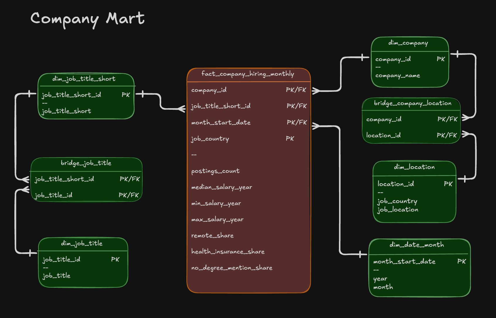

# 🏛️ End-to-End DuckDB & MotherDuck Data Warehouse & Analytical Marts

[](https://duckdb.org/)
[](https://motherduck.com/)
[](https://cloud.google.com/storage)
[]()
[]()

An end-to-end data engineering pipeline that ingests raw job market datasets from Google Cloud Storage, models them into an enterprise Kimball star schema, and delivers domain-optimized analytical marts in DuckDB and MotherDuck.


---

## 📌 Executive Summary

As organizations scale, querying raw flat data or transactional schemas directly leads to slow ad-hoc analytics, inconsistent KPI definitions, and strained compute resources. 

In this project, I architected a production-ready **ELT pipeline and analytical storage layer** using **DuckDB** and **MotherDuck**:
- **Ingestion & Normalization:** Extracted remote CSVs directly from Google Cloud Storage via DuckDB's `httpfs` and transformed them into a 3NF/Kimball star schema warehouse.
- **Many-to-Many Bridge Modeling:** Modeled complex relational hierarchies (jobs-to-skills, companies-to-locations, and granular job titles to standardized short titles) using optimized bridge tables.
- **Incremental CDC / Upsert Pattern:** Built automated change-data-capture logic using SQL `MERGE INTO` (insert, update, delete in a single atomic transaction) for tracking priority hiring roles.
- **Modular Data Marts:** Built four business-facing marts (`flat_mart`, `skills_mart`, `priority_mart`, and `company_mart`) with additive measures for flexible BI dashboard consumption.
- **Hybrid Local-to-Cloud Portability:** Automated the entire build via `build_dw_marts.sql`, fully executable locally or directly on **MotherDuck** serverless cloud data warehouse.

---

## 📐 Pipeline Architecture & Data Flow



---

## 🗄️ Data Model & Schema Design

### 1. Core Data Warehouse (Star Schema)
Serves as the single source of truth, enforcing entity integrity, foreign keys, and normalized dimensions.


- **`job_postings_fact`**: Central fact table tracking job postings, salary figures, and remote/workforce parameters.
- **`company_dim`**: Distinct company entities.
- **`skills_dim`**: Categorized technical and business skills.
- **`skills_job_dim`**: Bridge table resolving the M:N relationship between postings and required skills.

---

### 2. Analytical Data Marts

| Mart | Schema Name | Purpose & Business Value | Grain | Key Features |
| :--- | :--- | :--- | :--- | :--- |
| **Flat Mart** | `flat_mart` | Fast exploration & self-serve reporting without joining dimension tables. | 1 row per job posting | Denormalized, pre-joined wide table. |
| **Skills Mart** | `skills_mart` | Tracks monthly demand velocity and salary distributions for specific skills. | `skill_id + month_start_date + job_title_short` | **Fully additive measures** (sums/counts) enabling safe re-aggregation at any rollup level. |
| **Priority Mart** | `priority_mart` | Executive tracking of strategic roles with live status changes. | 1 row per priority job | **Production-grade `MERGE INTO` (upsert)** with source synchronization. |
| **Company Mart** | `company_mart` | Deep-dive hiring intelligence by company, location, and role hierarchy. | `company_id + job_title_short_id + month_start_date + job_country` | Dual bridge tables (`bridge_job_title`, `bridge_company_location`) and monthly trend aggregations. |

#### Schema Breakdown of Specialized Marts:

<details>
<summary><b>Click to expand schemas for each Data Mart</b></summary>

#### Flat Mart


#### Skills Mart


#### Priority Mart


#### Company Mart


</details>

---

## 💡 Engineering Highlights & Key Patterns

### 1. Robust Incremental Upsert with `MERGE INTO`
Rather than dropping and recreating snapshot tables on every run, the priority mart utilizes a production-grade `MERGE INTO` statement to update changing roles, insert new jobs, and prune removed listings in a single atomic transaction:

```sql
MERGE INTO priority_mart.priority_jobs_snapshot tgt 
USING src_priority_jobs src 
ON tgt.job_id = src.job_id

-- 1. Update changed records
WHEN MATCHED AND tgt.priority_lvl IS DISTINCT FROM src.priority_lvl THEN
    UPDATE SET 
        priority_lvl = src.priority_lvl,
        updated_at = src.updated_at

-- 2. Insert new records
WHEN NOT MATCHED THEN 
    INSERT (job_id, job_title_short, company_name, job_posted_date, salary_year_avg, priority_lvl, updated_at)
    VALUES (job_id, job_title_short, company_name, job_posted_date, salary_year_avg, priority_lvl, updated_at)

-- 3. Delete records removed from upstream source
WHEN NOT MATCHED BY SOURCE THEN DELETE;
```

### 2. Multi-Level Bridge Tables for High-Cardinality Relations
Standard star schemas break down when handling many-to-many relationships or differing grains. In `company_mart`, I implemented:
- **`bridge_company_location`**: Maps multi-office companies to their respective countries and cities.
- **`bridge_job_title`**: Normalizes free-text job titles (`dim_job_title`) to standardized industry roles (`dim_job_title_short`) without losing granular role descriptions.

### 3. Additive vs. Non-Additive Metrics
In analytical mart design, pre-computing percentages or averages across granular groups often prevents users from aggregating them later. 
- In `skills_demand_monthly`, raw counts and sums (`job_count`, `total_salary_year`, `salary_year_count`) are stored so downstream BI tools can compute weighted averages dynamically at any date or role granularity.
- In `fact_company_hiring_monthly`, analytical share ratios (`remote_share`, `health_insurance_share`, `no_degree_mention_share`) are pre-calculated for instant executive dashboard cards.

---

## 📁 Repository Structure

```text
04_duckdb_ETL/
├── 01_create_tables.sql         # Core star schema DDL (DDL, primary keys, foreign keys)
├── 02_load_schema_dw.sql       # Remote ingestion from GCS using httpfs
├── 03_create_flat_mart.sql     # Ad-hoc denormalized analytical table
├── 04_create_skills_mart.sql   # Time-series skills demand mart with additive metrics
├── 05_create_priority_mart.sql # Priority role definition and initial snapshot table
├── 06_update_priority_mart.sql # Production MERGE upsert pattern for incremental updates
├── 07_create_company_mart.sql  # Company hiring mart with multi-level bridge tables
├── build_dw_marts.sql          # Master orchestration script
├── images/                     # Architectural and ERD diagrams
└── README.md                   # Project documentation
```

---

## 🚀 How to Run the Pipeline

### Prerequisites
- [DuckDB CLI](https://duckdb.org/docs/installation/) installed locally (v1.0+)
- *(Optional)* [MotherDuck](https://motherduck.com/) account for cloud deployment

### 1. Run Entire Pipeline Locally
Execute the master build script to create the local DuckDB database (`dw_marts.duckdb`):

```bash
cd 04_duckdb_ETL
duckdb dw_marts.duckdb -c ".read build_dw_marts.sql"
```

### 2. Deploy Directly to MotherDuck (Cloud)
To build and persist the entire data warehouse and all data marts directly in your MotherDuck cloud account:

```bash
cd 04_duckdb_ETL
duckdb md:dw_marts -c ".read build_dw_marts.sql"
```

### 3. Explore the Data Interactively
Launch interactive sessions with either local or cloud storage:

```bash
# Local session
duckdb dw_marts.duckdb

# Or cloud session
duckdb md:dw_marts
```

Inspect the generated schemas and tables:
```sql
-- View all marts and tables
SHOW ALL TABLES;

-- Sample monthly skill demand
SELECT * FROM skills_mart.skills_demand_monthly LIMIT 10;

-- Inspect company hiring metrics
SELECT * FROM company_mart.fact_company_hiring_monthly LIMIT 10;
```

---

## 🛠️ Tech Stack & Key Competencies

- **OLAP Engine:** DuckDB, MotherDuck
- **Language:** SQL (Complex CTEs, Window Functions, Aggregate & Statistical functions `MEDIAN`, `DATE_TRUNC`, `CASE WHEN`, `MERGE INTO`)
- **Data Modeling:** Kimball Methodology, Star Schema, Dimensional Modeling, Bridge Tables, Surrogate Keys
- **Data Engineering Practices:** Idempotent DDL, Data Validation Checkpoints, Slowly Changing Dimensions / Snapshots, Additive Measure Design
- **Cloud & Tooling:** Google Cloud Storage (`httpfs`), Git, Linux / WSL
